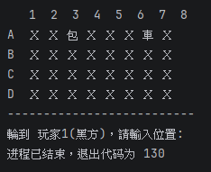

# H1 Report

* Name: 楊博宇
* ID: D1227477

---

## 題目：象棋翻棋遊戲

## 設計方法概述
本程式採用物件導向程式設計 (OOP) 的概念來模擬傳統的暗棋遊戲。主要設計方法包含以下幾個核心類別
：
玩家設定 (Player 類別)：儲存玩家姓名與所屬陣營（0代表紅方，1代表黑方，-1代表尚未決定）
。
遊戲抽象化 (AbstractGame 抽象類別)：定義遊戲的基本元素，包含兩位玩家 (p1, p2) 以及當前輪到的玩家 (currentPlayer)，為未來的擴充保留彈性
。
棋子設計 (Chess 類別)：記錄棋子的屬性，包含名稱、大小階級 (weight)、陣營 (side)、棋盤位置 (loc) 以及是否已經翻開的狀態 (isFlipped)
。
遊戲主體 (ChessGame 類別)：繼承自 AbstractGame，實作了暗棋的核心資料結構，包含一個 8 列 4 行的二維陣列 (Chess[][] board = new Chess) 作為棋盤，並使用變數記錄紅黑雙方的剩餘棋子數量（預設各 16 顆），以及判斷是否為遊戲的第一步 (firstFlip)
。

## 程式、執行畫面及其說明
迴圈的內容如下：

```java
for (int i = 1; i <= 5; i++) {
    System.out.println("i = " + i);
}
```

每一次，i 的值會變化。執行的畫面如下：



# AI 使用狀況與心得

這個展示比較容易，所以沒有用到 AI

## 心得
我學到的迴圈的使用。
